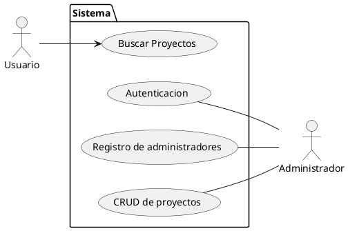
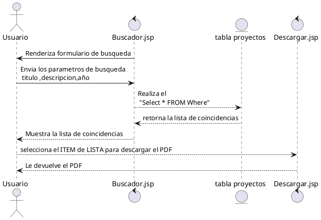
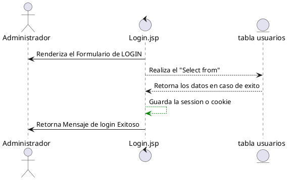
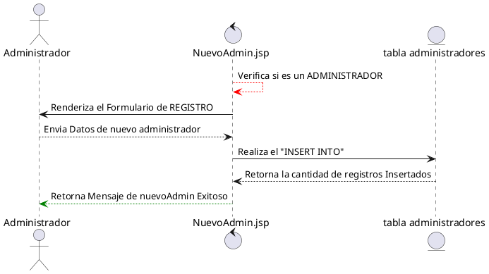
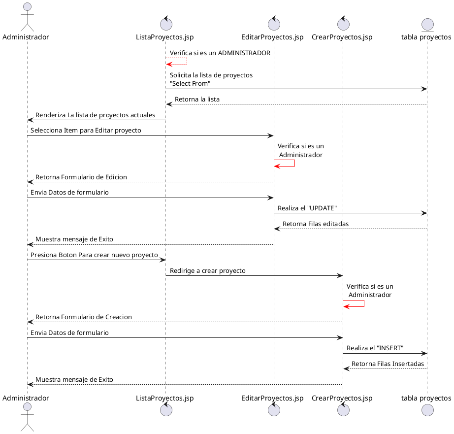

# Leer este Documento
Para Leer este documento se necesitan VSCODE con los siguientes plugins
- bierner.markdown-mermaid
- bpruitt-goddard.mermaid-markdown-syntax-highlighting

para *plantuml* solo es necesario las URL
# Diagrama de casos de USO
https://www.plantuml.com/plantuml/png/POvDJW9148NtVOeNzYmKreOHzne81wXqbsF7cIbIFmjZlBipIAGJTg-hlwhlxSn9FSOX3VpkS87M_iDHgdBsAbEYxA8uMP1M0HdYEkhAMATghbH4bmzAPygVr3EEyvX7mdS2mZYJCLRFOPaKRofVd5rijUpik-FhGqjruJnvpPHd-J_os287xXUje32eBS6tcvjsONyulIpm-KwzJJyf1TRhfskJYsn-WovnSulRlxZZgSGu_080

# Diagrama de secuencias
## De lado del "Usuario" "Buscar Proyectos"
https://www.plantuml.com/plantuml/dpng/VP1HIiD048RVSueXZz9u016fqXOABKfRyKMGQNRKbSrEdDqjr5jv1Y_cR6ZJr0SX17Psld--sN68A34rhi0wii1ZI2YM0GEaecOVXHsKTodKQ5WkFq9RvhljeL2GZpRkeOouTGYjy9uq9tHDSUjU-iefR4BAoXkUqionKYIuhlfmk88LUKDYln1UMPhaEZT3kUKpaK45gfiXCFKxY-0uG8k23Ud8C0IUFQXmSWoZF5LiMrls8_pvvgAFgJJpJ3wBeCiQv3IXN9FJEbp0R7M_XATt4YfxN5Ue_k92aSMhc7usHCnADLjVMqFwmz1jVhRwCb68yZ-YegV7KoPahxnG5eNvPhhCr6A-tjnsxp5erlk7oUmmTfYn83tk4haT7PkACNcJ6lSB

## De lado de "Administrador" "Autenticacion"

https://www.plantuml.com/plantuml/dpng/PO_FIWGn3CRlVOemdiS7a4NMWox2gg174SbEuz8raqYIWlhqpf-PWtefVCttww_PUg15xJbX5sfmbViYnSCm3maTC7KgOShGxFLOvFpa7yquu34baYZn1KtWWH6gLxIYFXNYmA_hHKBOj3C25_18aidADm8ntAZrbSSMP8Bzm-xsFit5jhtyzSX48YzSyqHCNS2RQTyinAPj_nEX9WWyf8mnd2JGeKys-YoXg-tvx6X4yZ9Oru_kAbf6O0Gdzw822ftgUw6_2ysIEnB74q6cPNGz2bnJsfBaslCF

## De lado de "Administrador" "Registro de administradores"
https://www.plantuml.com/plantuml/dpng/TL3TQl904BtVfpZ4wtmFy26YO5foOOGelH4fOtOgAvlTCZkHjazV4agxIdjxViwPCyka93hqtb2dKR2olGikgP2D0aeWqyMW4ZsAPk1hd0J_Bkcr6Ddm3HaEwlGTXTB94oZFuJI9zUIVxt3p4u3oC1EsntA13FoF9nRtuZf2Sk248M2rtjHDlTktg_MsDOHvUUjeELWMzq5WZuSe_U19N8HbjDNZQDmQGdbVL8Mh8wn9Ongb4tUxmzoSk_Xjq5HF_gkyg9jTrUvHD_jjWTmzByi_xHeb43oXew3EaeLb29z7MKoeGs9HiZ6PQVnXTXRcSCo_aELiE2IwC2pdVFNcDAPep9A37Nh_2G00

## De lado de "Administrador" "CRUD de proyectos"
https://www.plantuml.com/plantuml/dpng/bPFTRjim38NlzHI4TvqzG34KpPO4CD1sWPFjPXq6rc875R8KK7Inxkbd1Lu8HzvFBaESStp8Jxb9WYnzvmss4XcMjdF19M6qaG4Je6bZ48uUgjjXZbkEhpH8qzldTAYoOZfM-TewGIxruxmqV62Qqq_7Xe8uUOLAyD4Z77xFZr9vzDzE4pCj1eilRvZiryNrMMEuWi_4xicr2Ca19UW3B5TtzNszspVBrSUcIBhMBuq9k-XTwmJ18_Yi1akWWeTGxSXJAx3Xs5NdWUyMYoAn8OaSDD3W8DFgAWkMsFr4k9tzChRIewTa30wzzVZQFFTgNGm8jL071sGSPQSOexR9BOkykLi-XEchCWRpmcejLjv4xdgFx29OohfSxq_zr-758Qmm_nhKJoTlMRh4rX3wV3loK7tQhfRxTLNO_WPdupmceEomcEONkuAxdlBkq558-4p7fNuuYM16AWNLBLCw8daV9GROPYOj4pA4dbwYWYbUflvTjAjrxBuJZ15gLkaKgiulPLeuvv5ccJ9Lqp-H3j8BYDRtktMphxBhCg1rICIALFVw3w8t56pV-Ly0

## Ejemplo usando el plugin para MERMAID
